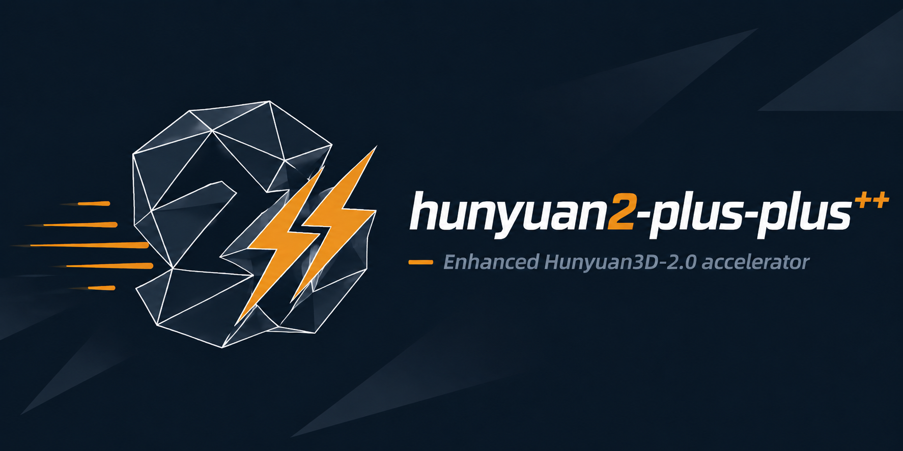

<div align="center">

<p align="center"></p>

# Hunyuan3D-2 mini + HiCache++

**Tencent's 0.6B image-to-3D, accelerated by training-free *exponential* velocity forecasting.**

*[Hunyuan3D-2 mini](https://huggingface.co/tencent/Hunyuan3D-2mini) with [HiCache++](https://github.com/Archerkattri/hicache-plus-plus)
wired natively into its flow-matching denoise loop: skip the DiT on most sampling steps and forecast the
cached velocity with a **Dynamic-Mode-Decomposition (Prony) exponential** basis — exact on the class the
diffusion features actually live in, so it stays lossless at larger skip intervals than the polynomial.*

[](https://github.com/Tencent-Hunyuan/Hunyuan3D-2)
&nbsp;[](https://arxiv.org/abs/2501.12202)
&nbsp;[](https://arxiv.org/abs/2508.16984)
&nbsp;[](./LICENSE)
&nbsp;-7a5cc6)

</div>

## When to use this repo

These repos are **complementary accelerators, not competing solutions** — each speeds up a *different*
base generator, and the `+` / `++` suffix is a **method choice**, not a rival product. Pick by
**(1) which base model you run**, then **(2) which forecast basis you want**:

| base generator | `+` = HiCache (Hermite) | `++` = HiCache++ (DMD) |
|---|---|---|
| Hunyuan3D-2.1 | `hunyuan2.1-plus` | `hunyuan2.1-plus-plus` |
| Hunyuan3D-2 mini | `hunyuan2-plus` | `hunyuan2-plus-plus` |
| SAM 3D Objects | `sam3d-plus` | `sam3d-plus-plus` |
| Fast-SAM3D | `fastsam3d-plus` | `fastsam3d-plus-plus` |
| TRELLIS (v1) | `faster-trellis` | `faster-trellis-plus-plus` |
| TRELLIS.2-4B (v2) | `hermit-trellis2` | `hermit-trellis2-plus-plus` |

- **`+` (HiCache / scaled-Hermite):** the *published* polynomial velocity-forecast basis — conservative, reproduces the HiCache paper. Use it to deploy the established method.
- **`++` (HiCache++ / DMD exponential):** our Dynamic-Mode-Decomposition basis — *the same near-lossless quality at wider skip intervals*, where the polynomial diverges. Use it when you push the cache interval for more speed.
- **standalone / model-agnostic:** [`hicache-plus-plus`](https://github.com/Archerkattri/hicache-plus-plus) — the forecaster itself, to add DMD caching to *your own* diffusion/flow model.
- **`fast-trellis2`** = the TaylorSeer baseline fork (the upstream "Fast" accel) — the v2 reference point, not a HiCache variant.

> **This repo:** `hunyuan2-plus-plus` — **Hunyuan3D-2 mini × HiCache++ (DMD)** — exactly lossless at interval-5 on the deployed mini model.

---

## What it is

This is a fork of **Hunyuan3D-2 mini** (Tencent's 0.6B shape generator, `Hunyuan3DDiTFlowMatchingPipeline`)
with **HiCache++** built directly into the diffusion sampler. The image-to-3D model is unchanged; the only
addition is a **feature cache on its flow-matching loop**, with both forecasters available:

- **HiCache** (Hermite polynomial, [arXiv:2508.16984](https://arxiv.org/abs/2508.16984)) — the comparison baseline.
- **HiCache++** (DMD / Prony exponential, *this work*) — the new method.

A flow-matching sampler integrates `dx/dt = v_θ(x, t)`, calling the expensive DiT at every step for the
velocity `v`. The cache computes the DiT only on `1/interval` of the steps and **forecasts** the velocity on
the rest, skipping `(interval-1)/interval` of the forward passes. The forecast is a first-class part of the
denoise loop (`__call__` calls the cache helpers directly — there is **no runtime monkey-patching**).

## Method — DMD exponential forecast (why it's exact)

Across timesteps the cached feature `F_t` (the CFG-combined velocity) is the solution of a slowly-varying,
**near-linear feature-ODE** `Ḟ = M F`. The exact solution of a linear ODE is a **sum of (damped /
oscillatory) exponentials** `F_t = Σ_j a_j e^{μ_j t}` — *not* a polynomial. HiCache's Hermite basis is only a
local Taylor truncation of that exponential, so it diverges under extrapolation, which is precisely why every
polynomial cache caps out at a modest skip.

**HiCache++** forecasts with **Dynamic Mode Decomposition** (Schmid 2010) — the SVD-regularised
generalisation of **Prony's method** (1795). It identifies the linear propagator `A` from raw velocity
snapshots (`F_{t+1} ≈ A F_t`), eigendecomposes it once, and predicts any (fractional) horizon `k` by
eigenvalue powers:

```
F_{t+k} ≈ Φ (λ**k ⊙ b),     b = Φ⁺ F_t
```

Because exponentials *are* the exact solution class, DMD is **exact on exponential trajectories** (the
property polynomials lack) and holds quality at skips where Hermite drifts. The window floor is **4 snapshots
(3 pairs)** — a real-valued trajectory spends two real DOF on every complex pole — and below it HiCache++
falls back to the Hermite forecast for warm-up. Full math and microbenchmarks are in the standalone
[**`hicache-plus-plus`**](https://github.com/Archerkattri/hicache-plus-plus) library.

## Use

Load the mini pipeline and turn on the **exponential** forecaster with one call before sampling:

```python
from PIL import Image
from hy3dgen.shapegen import Hunyuan3DDiTFlowMatchingPipeline

pipe = Hunyuan3DDiTFlowMatchingPipeline.from_pretrained(
    'tencent/Hunyuan3D-2mini', subfolder='hunyuan3d-dit-v2-mini',
)

# HiCache++ (DMD exponential): forecast skipped-step velocities from raw snapshots.
pipe.enable_dmd(
    interval=5,        # N: 1 compute step, then interval-1 forecasts
    first_enhance=2,   # always compute the first few steps (warm-up)
    end_enhance=None,  # always compute steps with index >= end_enhance (default: none)
    history=5,         # DMD snapshot window (>= 4 to fit a complex pole)
    max_order=2,       # Hermite order for the warm-up fallback
    sigma=0.5,         # Hermite contraction σ ∈ (0,1) for the fallback
)

mesh = pipe(image=Image.open('assets/demo.png').convert('RGBA'))[0]
mesh.export('demo.glb')
```

`enable_dmd` is shorthand for `enable_hicache(..., backend="dmd")`; the **Hermite baseline** is the same call
with `backend="hermite"` (the default), so you can A/B the two bases on identical schedules:

```python
pipe.enable_hicache(interval=5, first_enhance=2, sigma=0.5)                 # Hermite (polynomial) baseline
pipe.enable_hicache(interval=5, first_enhance=2, backend="dmd", history=5)  # DMD (exponential) == enable_dmd
# pipe.disable_hicache()                                                    # restore the uncached sampler
```

`enable_dmd` / `enable_hicache` just store the config; `Hunyuan3DDiTFlowMatchingPipeline.__call__` reads it and
runs the compute/forecast schedule natively — see the exponential forecaster in
[`hy3dgen/shapegen/hicache_dmd.py`](hy3dgen/shapegen/hicache_dmd.py), the Hermite baseline in
[`hy3dgen/shapegen/hicache.py`](hy3dgen/shapegen/hicache.py), and the denoise loop in
[`hy3dgen/shapegen/pipelines.py`](hy3dgen/shapegen/pipelines.py).

## Results

On the **deployed Hunyuan3D-2 mini**, HiCache++ (DMD) is **exactly lossless at interval-5** — F-score **0.794**,
identical to the uncached baseline **0.794**. The exponential basis is what extends the lossless skip range:
where the Hermite (polynomial) baseline decays as the skip grows, DMD degrades gracefully and its lead grows
with the interval (on Hunyuan3D-2.1, `+0.13` F-score at interval-5, `+0.24` at interval-6).

Full A/B tables (Hunyuan3D-2.1, SAM3D, the controlled forecast microbenchmark) and the math live in the
standalone [**`hicache-plus-plus`**](https://github.com/Archerkattri/hicache-plus-plus) library. The Hermite-only sibling fork is
[**`hunyuan2-plus`**](https://github.com/Archerkattri/hunyuan2-plus).

## Attribution

- **Hunyuan3D-2 / Hunyuan3D-2 mini** © Tencent — see [`LICENSE`](LICENSE) and [`NOTICE`](NOTICE)
  (Tencent Hunyuan 3D 2.0 Community License Agreement; note its territorial limits, large-user
  threshold, and no-competing-model-training restrictions). This fork adds only the cache
  integration; the model, weights, and pipeline are unchanged.
- **HiCache** — *Training-free Acceleration of Diffusion Models via Hermite Polynomial Feature Forecasting*
  ([arXiv:2508.16984](https://arxiv.org/abs/2508.16984)); the Hermite baseline here is a clean
  reimplementation. Built on **TaylorSeer** (monomial feature caching).
- **HiCache++** *(this work)* — the **DMD / Prony exponential** forecaster
  ([`hicache_dmd.py`](hy3dgen/shapegen/hicache_dmd.py), packaged as
  [`hicache-plus-plus`](https://github.com/Archerkattri/hicache-plus-plus)). DMD (Schmid 2010) / Prony (1795) / Matrix-Pencil
  (Hua–Sarkar 1990) are classical spectral estimation; their application to diffusion feature caching is, to
  our knowledge, new.

## Weights & data

Model weights and demo/example assets are **not** committed to this repo — only the acceleration
architecture (code + integration). Download the base-model weights from the upstream project,
[Tencent-Hunyuan/Hunyuan3D-2](https://github.com/Tencent-Hunyuan/Hunyuan3D-2), per its instructions, and point the loader at them (see the code / upstream README). This
keeps the repository lightweight and avoids redistributing third-party weights.

## Citation

If you use this work, please cite the base model (Tencent Hunyuan3D-2) and the acceleration methods (HiCache and the DMD/Prony forecaster):

```bibtex
@misc{lai2025flashvdm,
      title={Unleashing Vecset Diffusion Model for Fast Shape Generation}, 
      author={Zeqiang Lai and Yunfei Zhao and Zibo Zhao and Haolin Liu and Fuyun Wang and Huiwen Shi and Xianghui Yang and Qinxiang Lin and Jinwei Huang and Yuhong Liu and Jie Jiang and Chunchao Guo and Xiangyu Yue},
      year={2025},
      eprint={2503.16302},
      archivePrefix={arXiv},
      primaryClass={cs.CV},
      url={https://arxiv.org/abs/2503.16302}, 
}
@misc{hunyuan3d22025tencent,
    title={Hunyuan3D 2.0: Scaling Diffusion Models for High Resolution Textured 3D Assets Generation},
    author={Tencent Hunyuan3D Team},
    year={2025},
    eprint={2501.12202},
    archivePrefix={arXiv},
    primaryClass={cs.CV}
}

@misc{yang2024hunyuan3d,
    title={Hunyuan3D 1.0: A Unified Framework for Text-to-3D and Image-to-3D Generation},
    author={Tencent Hunyuan3D Team},
    year={2024},
    eprint={2411.02293},
    archivePrefix={arXiv},
    primaryClass={cs.CV}
}
```

```bibtex
@misc{hicache2025, title={HiCache: Training-free Acceleration of Diffusion Models via Hermite Polynomial Feature Forecasting}, eprint={2508.16984}, archivePrefix={arXiv}, year={2025}}
```

```bibtex
@article{schmid2010dmd, title={Dynamic mode decomposition of numerical and experimental data}, author={Schmid, Peter J.}, journal={Journal of Fluid Mechanics}, volume={656}, pages={5--28}, year={2010}}
```

---

## Family

Part of the **HiCache++ acceleration family**.

- **Family hub:** [`hicache-plus-plus`](https://github.com/Archerkattri/hicache-plus-plus) — the basis library behind this adapter.
- **Sibling:** [`hunyuan2-plus`](https://github.com/Archerkattri/hunyuan2-plus) — the same base model with the HiCache (scaled-Hermite) polynomial-forecast variant.
